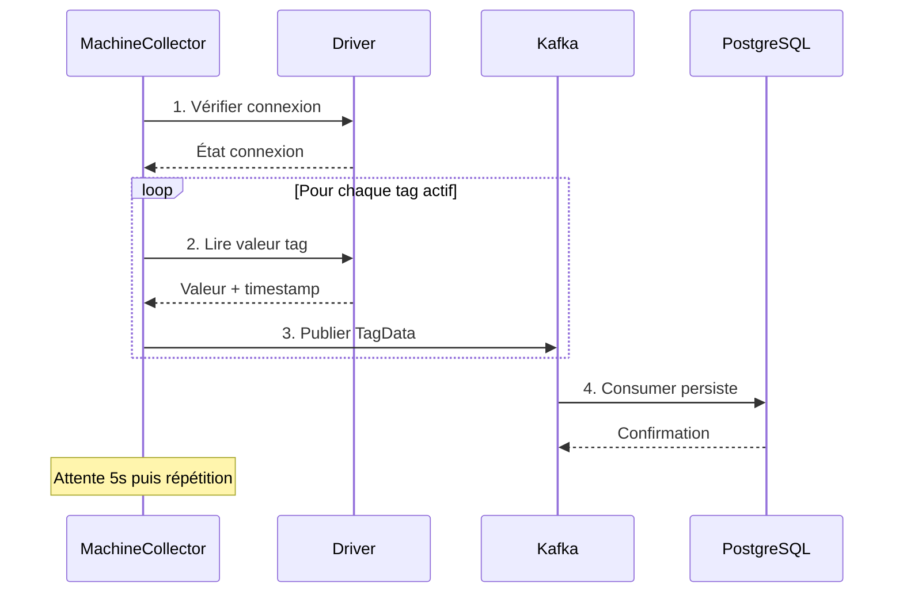
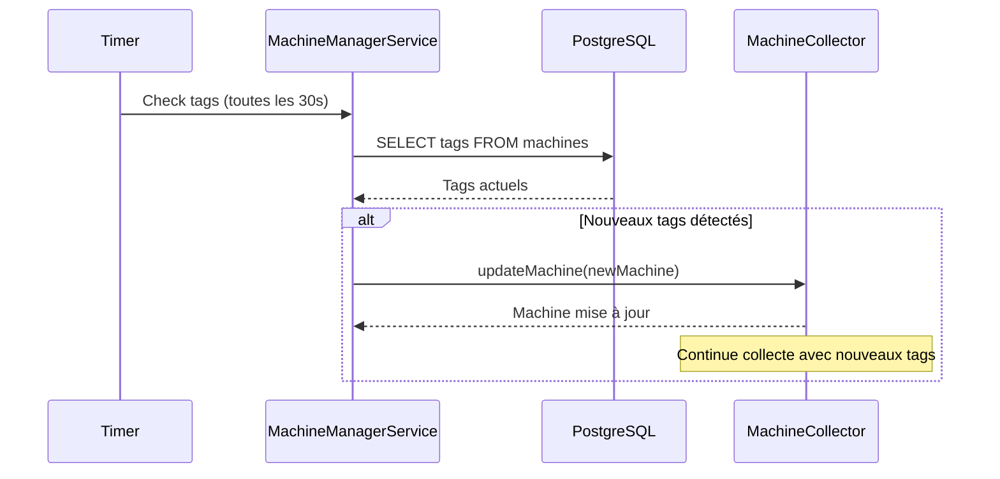

# 🏭 DOBI - Système SCADA/IoT Industriel

> **DOBI** est un système de collecte de données industrielles temps réel permettant la communication avec des équipements PLC/automates via plusieurs protocoles (OPC UA, Siemens S7, Modbus TCP) et l'historisation des données via Apache Kafka et PostgreSQL.


---

## 📋 Table des Matières

- [🎯 Vue d'ensemble](#-vue-densemble)
- [🏗️ Architecture](#️-architecture)
- [🚀 Fonctionnalités](#-fonctionnalités)
- [📊 Protocoles Supportés](#-protocoles-supportés)
- [⚙️ Installation](#️-installation)
- [🔧 Configuration](#-configuration)
- [📡 API REST](#-api-rest)
- [📝 Système de Logs](#-système-de-logs)
- [🔄 Flux de Données](#-flux-de-données)
- [🧪 Tests et Diagnostic](#-tests-et-diagnostic)
- [📈 Monitoring](#-monitoring)
- [🛠️ Développement](#️-développement)
- [📚 Documentation Technique](#-documentation-technique)

---

## 🎯 Vue d'ensemble

### **Problématique Résolue**
DOBI répond aux besoins industriels de **collecte**, **historisation** et **supervision** de données temps réel depuis des équipements hétérogènes (PLC Siemens, serveurs OPC UA, équipements Modbus) vers un système centralisé.

### **Architecture Multi-Modules**
```
dobi-parent/
├── dobi-drivers/          # Modules de communication
│   ├── dobi-driver-opcua/     # Driver OPC UA
│   ├── dobi-driver-siemens/   # Driver Siemens S7
│   └── dobi-driver-modbus/    # Driver Modbus TCP
├── dobi-core/             # Entités JPA et services métier
└── dobi-web/              # API REST et interface web
```

---

## 🏗️ Architecture

### **🔄 Flux de Données Temps Réel**


### **📦 Composants Principaux**

| Composant | Responsabilité | Statut |
|-----------|---------------|---------|
| **MachineManagerService** | Orchestration des collecteurs | ✅ Complet |
| **MachineCollector** | Collecte par machine | ✅ Complet |
| **IDriver Interface** | Abstraction drivers | ✅ Complet |
| **KafkaServices** | Messaging temps réel | ✅ Complet |
| **LogLevelManager** | Logs configurables | ✅ Complet |
| **SupervisionService** | API de monitoring | ✅ Complet |

---

## 🚀 Fonctionnalités

### **📡 Communication Industrielle**
- ✅ **OPC UA** : Sécurité avancée, subscriptions, reconnexion auto
- ✅ **Siemens S7** : S7-300/400/1200/1500, lecture batch, métriques
- ✅ **Modbus TCP** : 4 zones mémoire, types multiples, diagnostics

### **⚡ Gestion Temps Réel**
- ✅ **Auto-reload** des nouveaux tags sans redémarrage
- ✅ **Reconnexion automatique** avec backoff exponentiel
- ✅ **Pool de threads** pour collecteurs multiples
- ✅ **Cache intelligent** pour optimisation performances

### **📊 Historisation & API**
- ✅ **Apache Kafka** pour messaging haute performance
- ✅ **PostgreSQL** avec audit trail et soft delete
- ✅ **API REST** complète pour supervision
- ✅ **Health checks** intégrés

### **🔧 Administration**
- ✅ **Logs configurables** par driver et niveau
- ✅ **Diagnostics** réseau et protocoles
- ✅ **Métriques** de performance temps réel
- ✅ **Configuration dynamique** via API

---

## 📊 Protocoles Supportés

### **🔌 OPC UA**
```yaml
Fonctionnalités:
  - Politiques sécurité: None, Basic256, Basic256Sha256
  - Authentification: Anonyme, Username/Password, Certificats X.509
  - Subscriptions temps réel avec callbacks
  - Tests automatiques de NodeId
  - Reconnexion intelligente
  
Types supportés:
  - Boolean, Integer, Float, Double, String, DateTime
  - Identifiants: Numeric, String, GUID, Opaque
```

### **⚙️ Siemens S7**
```yaml
CPU supportées:
  - S7-300 (via SNAP7/Moka7)
  - S7-400 (via SNAP7/Moka7)  
  - S7-1200 (via SNAP7/Moka7)
  - S7-1500 (via SNAP7/Moka7)
  
Zones mémoire:
  - DB (Data Blocks)
  - M (Memory/Merkers)
  - E/I (Inputs)
  - A/Q (Outputs)
  - T (Timers)
  - C (Counters)
  
Types supportés:
  - BOOL, BYTE, WORD, DWORD
  - INT, DINT, REAL, STRING
  - DATETIME
```

### **📡 Modbus TCP**
```yaml
Zones mémoire:
  - Coils (Read/Write bits)
  - Discrete Inputs (Read-only bits)
  - Holding Registers (Read/Write 16-bit)
  - Input Registers (Read-only 16-bit)
  
Types supportés:
  - INT (16-bit signed)
  - UINT (16-bit unsigned)
  - DINT (32-bit signed)
  - UDINT (32-bit unsigned)
  - REAL (32-bit float)
```

---

## ⚙️ Installation

### **🔧 Prérequis**
```bash
# Java Development Kit
java -version  # Java 17+

# Apache Maven
mvn -version   # Maven 3.8+

# PostgreSQL
psql --version # PostgreSQL 14+

# Apache Kafka
kafka-topics.sh --version # Kafka 2.8+
```

### **📦 Construction**
```bash
# Clone du projet
git clone <repository-url>
cd dobi-parent

# Compilation multi-modules
mvn clean install

# Construction avec tests
mvn clean install -DskipTests=false
```

### **🗄️ Base de Données**
```sql
-- Création de la base
CREATE DATABASE dobi;
CREATE USER dobi_user WITH PASSWORD 'dobi_password';
GRANT ALL PRIVILEGES ON DATABASE dobi TO dobi_user;

-- Les tables sont créées automatiquement par JPA/Hibernate
```

### **📨 Kafka**
```bash
# Démarrage Zookeeper
bin/zookeeper-server-start.sh config/zookeeper.properties

# Démarrage Kafka
bin/kafka-server-start.sh config/server.properties

# Création du topic (optionnel, auto-créé)
bin/kafka-topics.sh --create --topic dobi-tags-data \
  --bootstrap-server localhost:9092 --partitions 3 --replication-factor 1
```

---

## 🔧 Configuration

### **📋 application.properties**
```properties
# Base de données
spring.datasource.url=jdbc:postgresql://localhost:5432/dobi
spring.datasource.username=dobi_user
spring.datasource.password=dobi_password
spring.jpa.hibernate.ddl-auto=update

# Kafka
kafka.bootstrap.servers=localhost:9092
kafka.topic.tags.data=dobi-tags-data

# Serveur web
server.port=8080
server.servlet.context-path=/

# Logs (optionnel)
logging.level.org.dobi=INFO
```

### **📋 drivers.properties**
```properties
# Mapping des drivers par type d'équipement
S7300_S7400=org.dobi.siemens.SiemensDriver
S71200=org.dobi.siemens.SiemensDriver  
S71500=org.dobi.siemens.SiemensDriver
OPC_UA=org.dobi.opcua.OpcUaDriver
MODBUS_TCP=org.dobi.modbus.ModbusDriver
```

### **💾 Configuration Base de Données**

#### **1. Configuration des Companies**
```sql
INSERT INTO companies (company, designation) VALUES 
('ENERGY', 'Société énergétique'),
('FACTORY', 'Usine de production');
```

#### **2. Configuration des Drivers**
```sql
INSERT INTO mach_drivers (driver, designation) VALUES 
('OPC_UA', 'Driver OPC UA'),
('S71500', 'Driver Siemens S7-1500'),
('MODBUS_TCP', 'Driver Modbus TCP');
```

#### **3. Configuration des Types et Zones Mémoire**
```sql
-- Types de données
INSERT INTO tags_types (type, designation) VALUES 
('BOOL', 'Boolean'),
('INT', 'Integer 16-bit'),
('REAL', 'Float 32-bit'),
('STRING', 'Chaîne de caractères');

-- Zones mémoire
INSERT INTO tags_memories (name, comment) VALUES 
('DB', 'Data Block Siemens'),
('HOLDING REGISTER', 'Holding Register Modbus');
```

#### **4. Exemple Machine OPC UA**
```sql
INSERT INTO machines (name, address, port, company, driver, 
                     opcua_security_policy, opcua_user, opcua_password) 
VALUES ('ENERGIE 1', '192.168.1.100', 4840, 
        (SELECT id FROM companies WHERE company='ENERGY'),
        (SELECT id FROM mach_drivers WHERE driver='OPC_UA'),
        'None', 'admin', 'password123');
```

#### **5. Exemple Tags OPC UA**
```sql
INSERT INTO tags (name, machine, type, memory, active,
                  opc_namespace_index, opc_identifier, opc_identifier_type)
VALUES ('frequency', 
        (SELECT id FROM machines WHERE name='ENERGIE 1'),
        (SELECT id FROM tags_types WHERE type='REAL'),
        (SELECT id FROM tags_memories WHERE name='OPC_VARIABLE'),
        true, 4, '|var|ENERGY_1.Application.GVL.tfos[0].stdset.frequency.value', 'STRING');
```

---

## 📡 API REST

### **📊 Supervision**
```bash
# Statut global de l'API
GET /api/v1/status

# Liste des machines et leur statut
GET /api/v1/machines

# Détails d'une machine spécifique
GET /api/v1/machines/{id}

# Redémarrage d'un collecteur
POST /api/v1/machines/{id}/restart

# Détails d'un tag
GET /api/v1/tags/{id}

# Historique d'un tag (paginé)
GET /api/v1/tags/{id}/history?page=0&size=100
```

### **🔄 Auto-reload des Tags**
```bash
# Statut du monitoring automatique
GET /api/v1/auto-reload/status

# Activation/désactivation
POST /api/v1/auto-reload/enable?enabled=true

# Configuration de l'intervalle
POST /api/v1/auto-reload/interval?seconds=30

# Vérification immédiate
POST /api/v1/auto-reload/check-now

# Démarrage/arrêt manuel
POST /api/v1/auto-reload/start
POST /api/v1/auto-reload/stop
```

### **🏥 Health Checks**
```bash
# Santé Kafka
GET /api/v1/health/kafka
```

### **📝 Gestion des Logs**
```bash
# État actuel des logs
GET /api/v1/logs/status

# Configuration globale
POST /api/v1/logs/global?level=INFO

# Configuration par driver
POST /api/v1/logs/driver/OPC-UA?level=DEBUG
POST /api/v1/logs/driver/SIEMENS-S7?level=TRACE
POST /api/v1/logs/driver/MODBUS-TCP?level=WARN

# Presets rapides
POST /api/v1/logs/preset/silent    # Erreurs seulement
POST /api/v1/logs/preset/minimal   # Erreurs + warnings
POST /api/v1/logs/preset/normal    # Mode standard
POST /api/v1/logs/preset/verbose   # Mode développement
POST /api/v1/logs/preset/debug     # Mode debug complet

# Remise à zéro
POST /api/v1/logs/reset

# Liste des niveaux disponibles
GET /api/v1/logs/levels
```

---

## 📝 Système de Logs

### **📊 Niveaux Disponibles**
```java
NONE   (0) // Aucun log
ERROR  (1) // Seulement les erreurs critiques  
WARN   (2) // Erreurs + avertissements
INFO   (3) // Erreurs + warnings + infos importantes
DEBUG  (4) // Tout (mode développement)
TRACE  (5) // Tout + traces détaillées
```

### **🎯 Configuration par Environnement**

#### **🔧 Développement**
```bash
curl -X POST "http://localhost:8080/api/v1/logs/preset/debug"
# OU configuration fine :
curl -X POST "http://localhost:8080/api/v1/logs/global?level=DEBUG"
curl -X POST "http://localhost:8080/api/v1/logs/driver/OPC-UA?level=TRACE"
```

#### **🧪 Test**
```bash
curl -X POST "http://localhost:8080/api/v1/logs/preset/normal"
```

#### **🚀 Production**
```bash
curl -X POST "http://localhost:8080/api/v1/logs/preset/silent"
```

### **📋 Logs par Composant**
```bash
# Drivers de communication
[OPC-UA-INFO] Connexion établie avec ENERGIE 1
[SIEMENS-S7-DEBUG] Lecture tag 'temperature' = 23.5°C  
[MODBUS-TCP-TRACE] Décodage REAL: 45.67

# Collecteurs
[COLLECTOR-INFO] Démarrage collecteur pour ENERGIE 1 (Driver: OPC-UA)
[COLLECTOR-DEBUG] Cycle terminé - 15 tags lus avec succès

# Services Kafka  
[KAFKA-PRODUCER-TRACE] Message envoyé - Partition: 0, Offset: 1234
[KAFKA-CONSUMER-DEBUG] 5 message(s) reçus de Kafka
```

---

## 🔄 Flux de Données

### **📊 Cycle de Collecte**


### **⚡ Auto-reload des Tags**


---

## 🧪 Tests et Diagnostic

### **🔍 Diagnostic OPC UA**
Le système inclut des tests automatiques pour OPC UA lors de la connexion :

```java
// Tests automatiques des identifiants UaExpert
opcDriver.testSpecificNodeId("|var|ENERGY_1.Application.GVL.tfos[0].stdset.frequency.value");
opcDriver.browseNamespace(4); // Exploration namespace
opcDriver.testUaExpertStructure(); // Tests de structure
```

### **🔧 Diagnostic Siemens S7**
```java
// Tests de connectivité et performance
siemensDriver.performNetworkDiagnostics();
siemensDriver.testTagRead(tag);
siemensDriver.getDiagnosticInfo();
```

### **📡 Diagnostic Modbus**
```java
// Validation configuration et tests
modbusDriver.testConnection();
modbusDriver.testTagRead(tag);
modbusDriver.validateTagConfiguration(tag);
```

### **🧪 Tests via API**
```bash
# Test de santé global
curl -X GET "http://localhost:8080/api/v1/status"

# Vérification Kafka
curl -X GET "http://localhost:8080/api/v1/health/kafka" 

# État des collecteurs
curl -X GET "http://localhost:8080/api/v1/machines"

# Logs en temps réel
curl -X POST "http://localhost:8080/api/v1/logs/preset/debug"
# Puis observer les logs dans la console
```

---

## 📈 Monitoring

### **📊 Métriques Disponibles**

#### **🔧 Par Driver**
- **Connexions** : Temps d'établissement, tentatives de reconnexion
- **Lectures** : Nombre total, succès/échecs, temps de réponse
- **Écritures** : Nombre total, succès/échecs
- **Erreurs** : Répartition par code d'erreur

#### **⚡ Par Collecteur**  
- **Tags lus** : Compteur total par machine
- **Statut** : Connecté, En erreur, Reconnexion
- **Performance** : Tags/seconde, cycles complets

#### **📨 Kafka**
- **Messages** : Envoyés, reçus, en erreur
- **Latence** : Temps de traitement des messages
- **Topics** : État des topics, partitions

### **📋 API de Monitoring**
```bash
# Métriques des collecteurs
curl -X GET "http://localhost:8080/api/v1/machines" | jq '.[].tagsReadCount'

# Auto-reload status avec statistiques  
curl -X GET "http://localhost:8080/api/v1/auto-reload/status" | jq

# État détaillé des logs
curl -X GET "http://localhost:8080/api/v1/logs/status" | jq
```

---

## 🛠️ Développement

### **🏗️ Architecture des Modules**

#### **📦 dobi-drivers**
```java
// Interface commune
public interface IDriver {
    void configure(Machine machine);
    boolean connect();
    Object read(Tag tag);
    void write(Tag tag, Object value);  
    void disconnect();
    boolean isConnected();
}

// Implémentations spécialisées
- OpcUaDriver.java    // Eclipse Milo
- SiemensDriver.java  // SNAP7/Moka7  
- ModbusDriver.java   // digitalpetri/modbus
```

#### **🎯 dobi-core**
```java
// Entités JPA avec audit trail
@Entity BaseEntity              // ID, created, changed, deleted
@Entity Machine                 // Équipements industriels
@Entity Tag                     // Points de données
@Entity PersStandard           // Historisation

// Services métier
MachineManagerService          // Orchestration
MachineCollector              // Collecte par machine
LogLevelManager              // Logs configurables
```

#### **🌐 dobi-web**
```java
// Controllers REST
SupervisionController         // Monitoring machines/tags
AutoReloadController         // Gestion auto-reload
HealthCheckController        // Health checks
LogController               // Configuration logs

// Services applicatifs  
SupervisionService          // Logique métier supervision
KafkaHealthCheckService    // Monitoring Kafka
```

### **🔄 Ajout d'un Nouveau Driver**

#### **1. Créer le module**
```bash
mkdir dobi-driver-mynewprotocol
cd dobi-driver-mynewprotocol
# Copier la structure de dobi-driver-modbus
```

#### **2. Implémenter IDriver**
```java
public class MyNewProtocolDriver implements IDriver {
    private static final String DRIVER_NAME = "MY-PROTOCOL";
    
    @Override
    public void configure(Machine machine) {
        LogLevelManager.logInfo(DRIVER_NAME, "Configuration...");
    }
    
    @Override
    public boolean connect() {
        // Logique de connexion
        LogLevelManager.logInfo(DRIVER_NAME, "Connexion...");
        return true;
    }
    
    // Implémenter les autres méthodes...
}
```

#### **3. Enregistrer le driver**
```properties
# Dans drivers.properties
MY_PROTOCOL=org.dobi.mynewprotocol.MyNewProtocolDriver
```

#### **4. Configuration base de données**
```sql
INSERT INTO mach_drivers (driver, designation) 
VALUES ('MY_PROTOCOL', 'Mon nouveau protocole');
```

### **🧪 Tests Unitaires**
```java
@SpringBootTest
class DriverTest {
    
    @Test
    void testOpcUaConnection() {
        OpcUaDriver driver = new OpcUaDriver();
        Machine machine = createTestMachine();
        driver.configure(machine);
        assertTrue(driver.connect());
    }
    
    @Test  
    void testSiemensTagRead() {
        // Test lecture tag Siemens
    }
}
```

---

## 📚 Documentation Technique

### **🗄️ Modèle de Données**

#### **Machine (Équipement industriel)**
```sql
CREATE TABLE machines (
    id BIGSERIAL PRIMARY KEY,
    name VARCHAR(255) NOT NULL,
    address VARCHAR(255) NOT NULL,     -- IP/hostname
    port INTEGER,                      -- Port de connexion
    rack INTEGER,                      -- Rack Siemens (optionnel)
    slot INTEGER,                      -- Slot Siemens (optionnel) 
    bus INTEGER,                       -- Unit ID Modbus (optionnel)
    
    -- OPC UA
    opcua_security_policy VARCHAR(255),
    opcua_user VARCHAR(255),
    opcua_password VARCHAR(255),
    opcua_keystore_path VARCHAR(255),
    opcua_keystore_password VARCHAR(255),
    
    -- Relations
    company BIGINT NOT NULL REFERENCES companies(id),
    driver BIGINT NOT NULL REFERENCES mach_drivers(id),
    
    -- Audit
    created TIMESTAMP DEFAULT NOW(),
    changed TIMESTAMP DEFAULT NOW(),
    deleted BOOLEAN DEFAULT FALSE
);
```

#### **Tag (Point de données)**
```sql
CREATE TABLE tags (
    id BIGSERIAL PRIMARY KEY,
    name VARCHAR(255) NOT NULL,
    active BOOLEAN DEFAULT TRUE,
    
    -- Adressage Siemens/Modbus
    db INTEGER,                        -- DB number (Siemens)
    byte INTEGER,                      -- Byte address
    bit INTEGER,                       -- Bit address (pour BOOL)
    
    -- OPC UA
    opc_namespace_index INTEGER,
    opc_identifier VARCHAR(500),
    opc_identifier_type VARCHAR(50),   -- STRING, NUMERIC, GUID, OPAQUE
    
    -- Valeurs actuelles (temps réel)
    v_float REAL,
    v_int INTEGER, 
    v_bool BOOLEAN,
    v_str VARCHAR(500),
    v_date_time TIMESTAMP,
    v_stamp TIMESTAMP,                 -- Timestamp de dernière lecture
    
    -- Relations
    machine BIGINT NOT NULL REFERENCES machines(id),
    type BIGINT NOT NULL REFERENCES tags_types(id),
    memory BIGINT NOT NULL REFERENCES tags_memories(id),
    
    -- Audit
    created TIMESTAMP DEFAULT NOW(),
    changed TIMESTAMP DEFAULT NOW(), 
    deleted BOOLEAN DEFAULT FALSE
);
```

#### **PersStandard (Historisation)**
```sql
CREATE TABLE pers_standard (
    id BIGSERIAL PRIMARY KEY,
    tag BIGINT NOT NULL,               -- Référence au tag
    company INTEGER NOT NULL,
    
    -- Valeurs historiques
    v_float REAL,
    v_int INTEGER,
    v_bool BOOLEAN, 
    v_str VARCHAR(500),
    v_date_time TIMESTAMP,
    v_stamp TIMESTAMP NOT NULL,        -- Timestamp de la valeur
    
    -- Audit
    created TIMESTAMP DEFAULT NOW(),
    changed TIMESTAMP DEFAULT NOW(),
    deleted BOOLEAN DEFAULT FALSE
);

-- Index pour performance
CREATE INDEX idx_pers_standard_tag_stamp ON pers_standard(tag, v_stamp DESC);
```

### **📋 Configuration Avancée**

#### **🔧 Personnalisation JPA**
```properties
# Configuration Hibernate avancée
spring.jpa.properties.hibernate.dialect=org.hibernate.dialect.PostgreSQLDialect
spring.jpa.properties.hibernate.jdbc.batch_size=20
spring.jpa.properties.hibernate.order_inserts=true
spring.jpa.properties.hibernate.order_updates=true
spring.jpa.properties.hibernate.jdbc.batch_versioned_data=true

# Pool de connexions
spring.datasource.hikari.maximum-pool-size=20
spring.datasource.hikari.minimum-idle=5
spring.datasource.hikari.connection-timeout=30000
```

#### **📨 Optimisation Kafka**
```properties
# Producer optimisé
spring.kafka.producer.batch-size=16384
spring.kafka.producer.linger-ms=5
spring.kafka.producer.compression-type=snappy

# Consumer optimisé  
spring.kafka.consumer.max-poll-records=500
spring.kafka.consumer.fetch-min-size=1024
spring.kafka.consumer.enable-auto-commit=true
```

### **🔒 Sécurité**

#### **🛡️ OPC UA avec Certificats**
```java
// Configuration certificats X.509
String keystorePath = "/path/to/client.p12";
String keystorePassword = "password";

// Le driver charge automatiquement les certificats
machine.setOpcuaKeystorePath(keystorePath);
machine.setOpcuaKeystorePassword(keystorePassword);
machine.setOpcuaSecurityPolicy("Basic256Sha256");
```

#### **🔐 Base de Données**
```properties
# Chiffrement des connexions
spring.datasource.url=jdbc:postgresql://localhost:5432/dobi?ssl=true&sslmode=require

# Utilisateur avec droits limités
CREATE ROLE dobi_readonly;
GRANT SELECT ON ALL TABLES IN SCHEMA public TO dobi_readonly;
```

---

## 🚀 Déploiement

### **📦 Construction pour Production**
```bash
# Build optimisé
mvn clean package -Dmaven.test.skip=true -Dspring.profiles.active=prod

# Génération JAR exécutable
ls dobi-web/target/dobi-web-*.jar
```

### **🐳 Docker (Optionnel)**
```dockerfile
FROM openjdk:17-jre-slim

COPY dobi-web/target/dobi-web-*.jar app.jar
COPY src/main/resources/application-prod.properties application.properties

EXPOSE 8080

ENTRYPOINT ["java", "-jar", "/app.jar", "--spring.config.location=classpath:/application.properties"]
```

### **🎯 Variables d'Environnement**
```bash
# Base de données
export DOBI_DB_URL=jdbc:postgresql://prod-db:5432/dobi
export DOBI_DB_USER=dobi_prod
export DOBI_DB_PASSWORD=secure_password

# Kafka
export DOBI_KAFKA_SERVERS=kafka1:9092,kafka2:9092,kafka3:9092

# Démarrage
java -jar dobi-web.jar \
  --spring.datasource.url=$DOBI_DB_URL \
  --spring.datasource.username=$DOBI_DB_USER \
  --spring.datasource.password=$DOBI_DB_PASSWORD \
  --kafka.bootstrap.servers=$DOBI_KAFKA_SERVERS
```

---

## 📞 Support et Contribution

### **🐛 Signalement de Bugs**
1. Vérifier les logs via `/api/v1/logs/status`
2. Activer le mode debug : `/api/v1/logs/preset/debug`
3. Reproduire le problème avec logs détaillés
4. Créer une issue avec logs et configuration

### **💡 Demandes de Fonctionnalités**
- Nouveaux protocoles industriels
- Améliorations des drivers existants  
- Nouvelles métriques de monitoring
- Optimisations de performance

### **🤝 Contribution**
```bash
# Fork et clone
git clone https://github.com/votre-username/dobi.git

# Branche feature
git checkout -b feature/nouveau-protocole

# Développement avec tests
mvn clean test

# Pull