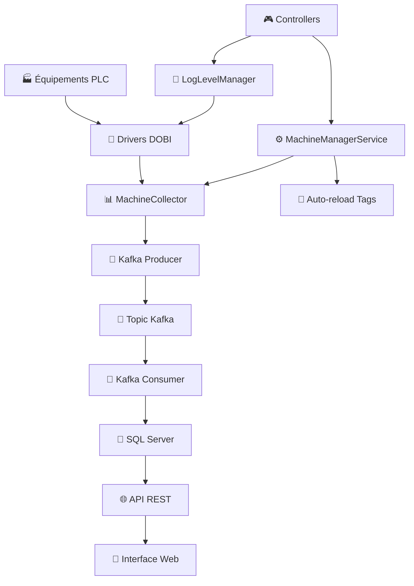
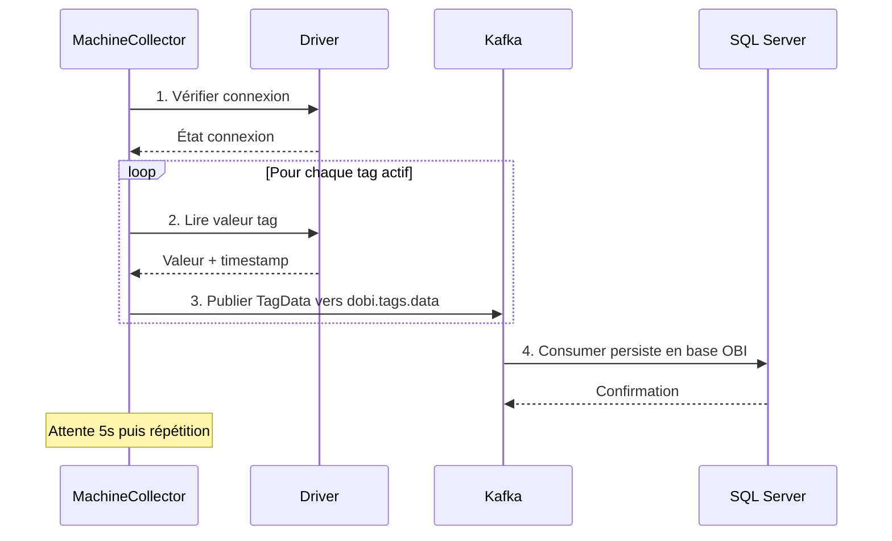

# 🏭 DOBI - Système SCADA/IoT Industriel

> **DOBI** est un système de collecte de données industrielles temps réel permettant la communication avec des équipements PLC/automates via plusieurs protocoles (OPC UA, Siemens S7, Modbus TCP) et l'historisation des données via Apache Kafka et Microsoft SQL Server.


---

## 📋 Table des Matières

- [🎯 Vue d'ensemble](#-vue-densemble)
- [🏗️ Architecture](#️-architecture)
- [🚀 Fonctionnalités](#-fonctionnalités)
- [📊 Protocoles Supportés](#-protocoles-supportés)
- [⚙️ Installation](#️-installation)
- [🔧 Configuration](#-configuration)
- [📡 API REST](#-api-rest)
- [📝 Système de Logs](#-système-de-logs)
- [🔄 Flux de Données](#-flux-de-données)
- [🧪 Tests et Diagnostic](#-tests-et-diagnostic)
- [📈 Monitoring](#-monitoring)
- [🛠️ Développement](#️-développement)
- [📚 Documentation Technique](#-documentation-technique)

---

## 🎯 Vue d'ensemble

### **Problématique Résolue**
DOBI répond aux besoins industriels de **collecte**, **historisation** et **supervision** de données temps réel depuis des équipements hétérogènes (PLC Siemens, serveurs OPC UA, équipements Modbus) vers un système centralisé.

### **Architecture Multi-Modules**
```
dobi-parent/
├── dobi-drivers/          # Modules de communication
│   ├── dobi-driver-opcua/     # Driver OPC UA
│   ├── dobi-driver-siemens/   # Driver Siemens S7
│   └── dobi-driver-modbus/    # Driver Modbus TCP
├── dobi-core/             # Entités JPA et services métier
└── dobi-web/              # API REST et interface web
```

---

## 🏗️ Architecture

### **🔄 Flux de Données Temps Réel**


### **📦 Composants Principaux**

| Composant | Responsabilité | Statut |
|-----------|---------------|---------|
| **MachineManagerService** | Orchestration des collecteurs | ✅ Complet |
| **MachineCollector** | Collecte par machine | ✅ Complet |
| **IDriver Interface** | Abstraction drivers | ✅ Complet |
| **KafkaServices** | Messaging temps réel | ✅ Complet |
| **LogLevelManager** | Logs configurables | ✅ Complet |
| **SupervisionService** | API de monitoring | ✅ Complet |

---

## 🚀 Fonctionnalités

### **📡 Communication Industrielle**
- ✅ **OPC UA** : Sécurité avancée, subscriptions, reconnexion auto
- ✅ **Siemens S7** : S7-300/400/1200/1500, IM151, lecture batch, métriques
- ✅ **Modbus TCP** : 4 zones mémoire, types multiples, diagnostics
- ✅ **WAGO OPC UA** : Support spécialisé pour équipements WAGO

### **⚡ Gestion Temps Réel**
- ✅ **Auto-reload** des nouveaux tags sans redémarrage
- ✅ **Reconnexion automatique** avec backoff exponentiel
- ✅ **Pool de threads** pour collecteurs multiples
- ✅ **Cache intelligent** pour optimisation performances

### **📊 Historisation & API**
- ✅ **Apache Kafka** pour messaging haute performance
- ✅ **Microsoft SQL Server** avec audit trail et soft delete
- ✅ **API REST** complète pour supervision
- ✅ **Health checks** intégrés

### **🔧 Administration**
- ✅ **Logs configurables** par driver et niveau
- ✅ **Diagnostics** réseau et protocoles
- ✅ **Métriques** de performance temps réel
- ✅ **Configuration dynamique** via API

---

## 📊 Protocoles Supportés

### **🔌 OPC UA**
```yaml
Fonctionnalités:
  - Politiques sécurité: None, Basic256, Basic256Sha256
  - Authentification: Anonyme, Username/Password, Certificats X.509
  - Subscriptions temps réel avec callbacks
  - Tests automatiques de NodeId
  - Reconnexion intelligente
  
Types supportés:
  - Boolean, Integer, Float, Double, String, DateTime
  - Identifiants: Numeric, String, GUID, Opaque

Équipements:
  - Serveurs OPC UA génériques
  - WAGO OPC UA (configuration spécialisée)
```

### **⚙️ Siemens S7**
```yaml
CPU supportées:
  - S7-300 (via SNAP7/Moka7)
  - S7-400 (via SNAP7/Moka7)  
  - S7-1200 (via SNAP7/Moka7)
  - S7-1500 (via SNAP7/Moka7)
  - IM151 (modules ET200S)
  
Zones mémoire:
  - DB (Data Blocks)
  - M (Memory/Merkers)
  - E/I (Inputs)
  - A/Q (Outputs)
  - T (Timers)
  - C (Counters)
  
Types supportés:
  - BOOL, BYTE, WORD, DWORD
  - INT, DINT, REAL, STRING
  - DATETIME
```

### **📡 Modbus TCP**
```yaml
Zones mémoire:
  - Coils (Read/Write bits)
  - Discrete Inputs (Read-only bits)
  - Holding Registers (Read/Write 16-bit)
  - Input Registers (Read-only 16-bit)
  
Types supportés:
  - INT (16-bit signed)
  - UINT (16-bit unsigned)
  - DINT (32-bit signed)
  - UDINT (32-bit unsigned)
  - REAL (32-bit float)
  - STRING (multi-registres)
```

---

## ⚙️ Installation

### **🔧 Prérequis**
```bash
# Java Development Kit
java -version  # Java 17+

# Apache Maven
mvn -version   # Maven 3.8+

# Microsoft SQL Server
sqlcmd -S server -Q "SELECT @@VERSION" # SQL Server 2019+

# Apache Kafka
kafka-topics.sh --version # Kafka 2.8+
```

### **📦 Construction**
```bash
# Clone du projet
git clone <repository-url>
cd dobi-parent

# Compilation multi-modules
mvn clean install

# Construction avec tests
mvn clean install -DskipTests=false
```

### **🗄️ Base de Données SQL Server**
```sql
-- Connexion à SQL Server
sqlcmd -S 10.242.14.2\BLCSCADA -U obi -P "ob!"

-- Vérification de la base OBI
USE OBI;
SELECT name FROM sys.tables WHERE name LIKE '%dobi%' OR name IN ('companies', 'machines', 'tags');

-- Les tables sont créées automatiquement par JPA/Hibernate
```

### **📨 Kafka**
```bash
# Configuration pour votre environnement
# Serveur Kafka : 10.242.14.3:7092
# Topic : dobi.tags.data

# Vérification du topic
kafka-topics.sh --bootstrap-server 10.242.14.3:7092 --list | grep dobi

# Création du topic si nécessaire
kafka-topics.sh --create --topic dobi.tags.data \
  --bootstrap-server 10.242.14.3:7092 --partitions 3 --replication-factor 1
```

---

## 🔧 Configuration

### **📋 application.properties**
```properties
# ===================================================================
# Fichier de configuration principal de l'application DOBI
# ===================================================================

# Adresse des serveurs Kafka (séparés par des virgules si plusieurs)
kafka.bootstrap.servers=10.242.14.3:7092

# Topic Kafka pour les données des tags
kafka.topic.tags.data=dobi.tags.data
```

### **📋 persistence.xml**
```xml
<?xml version="1.0" encoding="UTF-8" standalone="yes"?>
<persistence xmlns="https://jakarta.ee/xml/ns/persistence"
             xmlns:xsi="http://www.w3.org/2001/XMLSchema-instance"
             version="3.0">
  <persistence-unit name="DOBI-PU" transaction-type="RESOURCE_LOCAL">
    <provider>org.hibernate.jpa.HibernatePersistenceProvider</provider>
    
    <!-- Entités JPA -->
    <class>org.dobi.entities.BaseEntity</class>
    <class>org.dobi.entities.Company</class>
    <class>org.dobi.entities.MachDriver</class>
    <class>org.dobi.entities.Machine</class>
    <class>org.dobi.entities.Tag</class>
    <class>org.dobi.entities.TagType</class>
    <class>org.dobi.entities.TagMemory</class>
    <class>org.dobi.entities.PersStandard</class>

    <properties>
      <!-- Configuration SQL Server -->
      <property name="jakarta.persistence.jdbc.driver" 
                value="com.microsoft.sqlserver.jdbc.SQLServerDriver"/>
      <property name="jakarta.persistence.jdbc.url" 
                value="jdbc:sqlserver://10.242.14.2\BLCSCADA:1433;databaseName=OBI;encrypt=true;trustServerCertificate=true;"/>
      <property name="jakarta.persistence.jdbc.user" value="obi"/>
      <property name="jakarta.persistence.jdbc.password" value="ob!"/>
      
      <!-- Configuration Hibernate -->
      <property name="hibernate.dialect" value="org.hibernate.dialect.SQLServerDialect"/>
      <property name="hibernate.show_sql" value="false"/>
      <property name="hibernate.format_sql" value="true"/>
    </properties>
  </persistence-unit>
</persistence>
```

### **📋 drivers.properties**
```properties
# ===================================================================
# Fichier de mapping des drivers
# Associe un nom de driver de la BDD à une classe Java.
# ===================================================================

# Drivers Siemens
S7300_S7400=org.dobi.siemens.SiemensDriver
S71200=org.dobi.siemens.SiemensDriver
S71500=org.dobi.siemens.SiemensDriver
IM151=org.dobi.siemens.SiemensDriver

# Driver Modbus
MODBUS_TCP=org.dobi.modbus.ModbusDriver

# Driver OPC UA
OPC_UA=org.dobi.opcua.OpcUaDriver
WAGO_UA=org.dobi.opcua.OpcUaDriver
```

### **💾 Configuration Base de Données**

#### **1. Configuration des Companies**
```sql
INSERT INTO companies (company, designation) VALUES 
('ENERGY', 'Société énergétique'),
('FACTORY', 'Usine de production');
```

#### **2. Configuration des Drivers**
```sql
INSERT INTO mach_drivers (driver, designation) VALUES 
('OPC_UA', 'Driver OPC UA'),
('WAGO_UA', 'Driver WAGO OPC UA'),
('S71500', 'Driver Siemens S7-1500'),
('S71200', 'Driver Siemens S7-1200'),
('S7300_S7400', 'Driver Siemens S7-300/400'),
('IM151', 'Driver Siemens IM151'),
('MODBUS_TCP', 'Driver Modbus TCP');
```

#### **3. Configuration des Types et Zones Mémoire**
```sql
-- Types de données
INSERT INTO tags_types (type, designation) VALUES 
('BOOL', 'Boolean'),
('INT', 'Integer 16-bit'),
('DINT', 'Double Integer 32-bit'),
('REAL', 'Float 32-bit'),
('STRING', 'Chaîne de caractères');

-- Zones mémoire Siemens
INSERT INTO tags_memories (name, comment) VALUES 
('DB', 'Data Block Siemens'),
('M', 'Memory/Merkers Siemens'),
('E', 'Inputs Siemens'),
('A', 'Outputs Siemens');

-- Zones mémoire Modbus
INSERT INTO tags_memories (name, comment) VALUES 
('COIL', 'Coil Modbus (Read/Write bits)'),
('DISCRETE INPUT', 'Discrete Input Modbus (Read-only bits)'),
('HOLDING REGISTER', 'Holding Register Modbus (Read/Write 16-bit)'),
('INPUT REGISTER', 'Input Register Modbus (Read-only 16-bit)');
```

#### **4. Exemple Machine OPC UA**
```sql
INSERT INTO machines (name, address, port, company, driver, 
                     opcua_security_policy, opcua_user, opcua_password) 
VALUES ('ENERGIE 1', '192.168.1.100', 4840, 
        (SELECT id FROM companies WHERE company='ENERGY'),
        (SELECT id FROM mach_drivers WHERE driver='OPC_UA'),
        'None', 'admin', 'password123');
```

#### **5. Exemple Machine Siemens S7-1500**
```sql
INSERT INTO machines (name, address, rack, slot, company, driver) 
VALUES ('AUTOMATE S7-1500', '192.168.1.200', 0, 1,
        (SELECT id FROM companies WHERE company='FACTORY'),
        (SELECT id FROM mach_drivers WHERE driver='S71500'));
```

#### **6. Exemple Machine Modbus TCP**
```sql
INSERT INTO machines (name, address, port, bus, company, driver) 
VALUES ('VARIATEUR MODBUS', '192.168.1.150', 502, 1,
        (SELECT id FROM companies WHERE company='FACTORY'),
        (SELECT id FROM mach_drivers WHERE driver='MODBUS_TCP'));
```

#### **7. Exemple Tags**
```sql
-- Tag OPC UA
INSERT INTO tags (name, machine, type, memory, active,
                  opc_namespace_index, opc_identifier, opc_identifier_type)
VALUES ('frequency', 
        (SELECT id FROM machines WHERE name='ENERGIE 1'),
        (SELECT id FROM tags_types WHERE type='REAL'),
        (SELECT id FROM tags_memories WHERE name='OPC_VARIABLE'),
        1, 4, '|var|ENERGY_1.Application.GVL.tfos[0].stdset.frequency.value', 'STRING');

-- Tag Siemens
INSERT INTO tags (name, machine, type, memory, active, db, byte, bit)
VALUES ('motor_running', 
        (SELECT id FROM machines WHERE name='AUTOMATE S7-1500'),
        (SELECT id FROM tags_types WHERE type='BOOL'),
        (SELECT id FROM tags_memories WHERE name='DB'),
        1, 1, 0, 0);

-- Tag Modbus
INSERT INTO tags (name, machine, type, memory, active, byte)
VALUES ('temperature', 
        (SELECT id FROM machines WHERE name='VARIATEUR MODBUS'),
        (SELECT id FROM tags_types WHERE type='REAL'),
        (SELECT id FROM tags_memories WHERE name='HOLDING REGISTER'),
        1, 100);
```

---

## 📡 API REST

### **📊 Supervision**
```bash
# Statut global de l'API
GET /api/v1/status

# Liste des machines et leur statut
GET /api/v1/machines

# Détails d'une machine spécifique
GET /api/v1/machines/{id}

# Redémarrage d'un collecteur
POST /api/v1/machines/{id}/restart

# Détails d'un tag
GET /api/v1/tags/{id}

# Historique d'un tag (paginé)
GET /api/v1/tags/{id}/history?page=0&size=100
```

### **🔄 Auto-reload des Tags**
```bash
# Statut du monitoring automatique
GET /api/v1/auto-reload/status

# Activation/désactivation
POST /api/v1/auto-reload/enable?enabled=true

# Configuration de l'intervalle
POST /api/v1/auto-reload/interval?seconds=30

# Vérification immédiate
POST /api/v1/auto-reload/check-now

# Démarrage/arrêt manuel
POST /api/v1/auto-reload/start
POST /api/v1/auto-reload/stop
```

### **🏥 Health Checks**
```bash
# Santé Kafka
GET /api/v1/health/kafka
```

### **📝 Gestion des Logs**
```bash
# État actuel des logs
GET /api/v1/logs/status

# Configuration globale
POST /api/v1/logs/global?level=INFO

# Configuration par driver
POST /api/v1/logs/driver/OPC-UA?level=DEBUG
POST /api/v1/logs/driver/SIEMENS-S7?level=TRACE
POST /api/v1/logs/driver/MODBUS-TCP?level=WARN

# Presets rapides
POST /api/v1/logs/preset/silent    # Erreurs seulement
POST /api/v1/logs/preset/minimal   # Erreurs + warnings
POST /api/v1/logs/preset/normal    # Mode standard
POST /api/v1/logs/preset/verbose   # Mode développement
POST /api/v1/logs/preset/debug     # Mode debug complet

# Remise à zéro
POST /api/v1/logs/reset

# Liste des niveaux disponibles
GET /api/v1/logs/levels
```

---

## 📝 Système de Logs

### **📊 Niveaux Disponibles**
```java
NONE   (0) // Aucun log
ERROR  (1) // Seulement les erreurs critiques  
WARN   (2) // Erreurs + avertissements
INFO   (3) // Erreurs + warnings + infos importantes
DEBUG  (4) // Tout (mode développement)
TRACE  (5) // Tout + traces détaillées
```

### **🎯 Configuration par Environnement**

#### **🔧 Développement**
```bash
curl -X POST "http://localhost:8080/api/v1/logs/preset/debug"
# OU configuration fine :
curl -X POST "http://localhost:8080/api/v1/logs/global?level=DEBUG"
curl -X POST "http://localhost:8080/api/v1/logs/driver/OPC-UA?level=TRACE"
```

#### **🧪 Test**
```bash
curl -X POST "http://localhost:8080/api/v1/logs/preset/normal"
```

#### **🚀 Production**
```bash
curl -X POST "http://localhost:8080/api/v1/logs/preset/silent"
```

### **📋 Logs par Composant**
```bash
# Drivers de communication
[OPC-UA-INFO] Connexion établie avec ENERGIE 1
[SIEMENS-S7-DEBUG] Lecture tag 'temperature' = 23.5°C  
[MODBUS-TCP-TRACE] Décodage REAL: 45.67

# Collecteurs
[COLLECTOR-INFO] Démarrage collecteur pour ENERGIE 1 (Driver: OPC-UA)
[COLLECTOR-DEBUG] Cycle terminé - 15 tags lus avec succès

# Services Kafka  
[KAFKA-PRODUCER-TRACE] Message envoyé - Partition: 0, Offset: 1234
[KAFKA-CONSUMER-DEBUG] 5 message(s) reçus de Kafka
```

---

## 🔄 Flux de Données

### **📊 Cycle de Collecte**


### **⚡ Auto-reload des Tags**


---

## 🧪 Tests et Diagnostic

### **🔍 Diagnostic OPC UA**
Le système inclut des tests automatiques pour OPC UA lors de la connexion :

```java
// Tests automatiques des identifiants UaExpert
opcDriver.testSpecificNodeId("|var|ENERGY_1.Application.GVL.tfos[0].stdset.frequency.value");
opcDriver.browseNamespace(4); // Exploration namespace
opcDriver.testUaExpertStructure(); // Tests de structure
```

### **🔧 Diagnostic Siemens S7**
```java
// Tests de connectivité et performance
siemensDriver.performNetworkDiagnostics();
siemensDriver.testTagRead(tag);
siemensDriver.getDiagnosticInfo();
```

### **📡 Diagnostic Modbus**
```java
// Validation configuration et tests
modbusDriver.testConnection();
modbusDriver.testTagRead(tag);
modbusDriver.testTagWrite(tag, value);
modbusDriver.validateTagConfiguration(tag);
```

### **🧪 Tests via API**
```bash
# Test de santé global
curl -X GET "http://localhost:8080/api/v1/status"

# Vérification Kafka (topic dobi.tags.data)
curl -X GET "http://localhost:8080/api/v1/health/kafka" 

# État des collecteurs
curl -X GET "http://localhost:8080/api/v1/machines"

# Logs en temps réel
curl -X POST "http://localhost:8080/api/v1/logs/preset/debug"
# Puis observer les logs dans la console
```

---

## 📈 Monitoring

### **📊 Métriques Disponibles**

#### **🔧 Par Driver**
- **Connexions** : Temps d'établissement, tentatives de reconnexion
- **Lectures** : Nombre total, succès/échecs, temps de réponse
- **Écritures** : Nombre total, succès/échecs
- **Erreurs** : Répartition par code d'erreur

#### **⚡ Par Collecteur**  
- **Tags lus** : Compteur total par machine
- **Statut** : Connecté, En erreur, Reconnexion
- **Performance** : Tags/seconde, cycles complets

#### **📨 Kafka**
- **Messages** : Envoyés vers dobi.tags.data, reçus, en erreur
- **Latence** : Temps de traitement des messages
- **Topics** : État du topic dobi.tags.data

#### **🗄️ SQL Server**
- **Connexions** : État des connexions à OBI
- **Transactions** : Commits/rollbacks
- **Tables** : Croissance des tables tags et pers_standard

### **📋 API de Monitoring**
```bash
# Métriques des collecteurs
curl -X GET "http://localhost:8080/api/v1/machines" | jq '.[].tagsReadCount'

# Auto-reload status avec statistiques  
curl -X GET "http://localhost:8080/api/v1/auto-reload/status" | jq

# État détaillé des logs
curl -X GET "http://localhost:8080/api/v1/logs/status" | jq
```

---

## 🛠️ Développement

### **🏗️ Architecture des Modules**

#### **📦 dobi-drivers**
```java
// Interface commune
public interface IDriver {
    void configure(Machine machine);
    boolean connect();
    Object read(Tag tag);
    void write(Tag tag, Object value);  
    void disconnect();
    boolean isConnected();
}

// Implémentations spécialisées
- OpcUaDriver.java    // Eclipse Milo
- SiemensDriver.java  // SNAP7/Moka7  
- ModbusDriver.java   // digitalpetri/modbus
```

#### **🎯 dobi-core**
```java
// Entités JPA avec audit trail
@Entity BaseEntity              // ID, created, changed, deleted
@Entity Machine                 // Équipements industriels
@Entity Tag                     // Points de données
@Entity PersStandard           // Historisation

// Services métier
MachineManagerService          // Orchestration
MachineCollector              // Collecte par machine
LogLevelManager              // Logs configurables
```

#### **🌐 dobi-web**
```java
// Controllers REST
SupervisionController         // Monitoring machines/tags
AutoReloadController         // Gestion auto-reload
HealthCheckController        // Health checks
LogController               // Configuration logs

// Services applicatifs  
SupervisionService          // Logique métier supervision
KafkaHealthCheckService    // Monitoring Kafka
```

---

## 📚 Documentation Technique

### **🗄️ Modèle de Données SQL Server**

#### **Base de Données : OBI**
```sql
-- Serveur : 10.242.14.2\BLCSCADA
-- Base : OBI
-- Utilisateur : obi
-- Mot de passe : ob!
```

#### **Machine (Équipement industriel)**
```sql
CREATE TABLE machines (
    id BIGINT IDENTITY(1,1) PRIMARY KEY,
    name NVARCHAR(255) NOT NULL,
    address NVARCHAR(255) NOT NULL,     -- IP/hostname
    port INT,                           -- Port de connexion
    rack INT,                           -- Rack Siemens (optionnel)
    slot INT,                           -- Slot Siemens (optionnel) 
    bus INT,                            -- Unit ID Modbus (optionnel)
    
    -- OPC UA
    opcua_security_policy NVARCHAR(255),
    opcua_user NVARCHAR(255),
    opcua_password NVARCHAR(255),
    opcua_keystore_path NVARCHAR(255),
    opcua_keystore_password NVARCHAR(255),
    hostname NVARCHAR(255),
    
    -- MQTT (extension future)
    mqtt_user NVARCHAR(255),
    mqtt_password NVARCHAR(255),
    
    -- Relations
    company BIGINT NOT NULL REFERENCES companies(id),
    driver BIGINT NOT NULL REFERENCES mach_drivers(id),
    
    -- Audit
    created DATETIME2 DEFAULT GETDATE(),
    changed DATETIME2 DEFAULT GETDATE(),
    deleted BIT DEFAULT 0
);
```

#### **Tag (Point de données)**
```sql
CREATE TABLE tags (
    id BIGINT IDENTITY(1,1) PRIMARY KEY,
    name NVARCHAR(255) NOT NULL,
    active BIT DEFAULT 1,
    
    -- Adressage Siemens/Modbus
    db INT,                             -- DB number (Siemens)
    byte INT,                           -- Byte address
    bit INT,                            -- Bit address (pour BOOL)
    
    -- OPC UA
    opc_namespace_index INT,
    opc_identifier NVARCHAR(500),
    opc_identifier_type NVARCHAR(50),   -- STRING, NUMERIC, GUID, OPAQUE
    
    -- Valeurs actuelles (temps réel)
    v_float REAL,
    v_int INT, 
    v_bool BIT,
    v_str NVARCHAR(500),
    v_date_time DATETIME2,
    v_stamp DATETIME2 NOT NULL,         -- Timestamp de la valeur
    
    -- Audit
    created DATETIME2 DEFAULT GETDATE(),
    changed DATETIME2 DEFAULT GETDATE(),
    deleted BIT DEFAULT 0
);

-- Index pour performance
CREATE INDEX idx_pers_standard_tag_stamp ON pers_standard(tag, v_stamp DESC);
```

### **📋 Configuration Avancée**

#### **🔧 Personnalisation JPA pour SQL Server**
```properties
# Configuration Hibernate avancée pour SQL Server
spring.jpa.properties.hibernate.dialect=org.hibernate.dialect.SQLServerDialect
spring.jpa.properties.hibernate.jdbc.batch_size=20
spring.jpa.properties.hibernate.order_inserts=true
spring.jpa.properties.hibernate.order_updates=true
spring.jpa.properties.hibernate.jdbc.batch_versioned_data=true

# Pool de connexions pour SQL Server
spring.datasource.hikari.maximum-pool-size=20
spring.datasource.hikari.minimum-idle=5
spring.datasource.hikari.connection-timeout=30000
spring.datasource.hikari.driver-class-name=com.microsoft.sqlserver.jdbc.SQLServerDriver
```

#### **📨 Optimisation Kafka**
```properties
# Configuration pour votre infrastructure Kafka
kafka.bootstrap.servers=10.242.14.3:7092
kafka.topic.tags.data=dobi.tags.data

# Producer optimisé
spring.kafka.producer.batch-size=16384
spring.kafka.producer.linger-ms=5
spring.kafka.producer.compression-type=snappy
spring.kafka.producer.key-serializer=org.apache.kafka.common.serialization.StringSerializer
spring.kafka.producer.value-serializer=org.apache.kafka.common.serialization.StringSerializer

# Consumer optimisé  
spring.kafka.consumer.max-poll-records=500
spring.kafka.consumer.fetch-min-size=1024
spring.kafka.consumer.enable-auto-commit=true
spring.kafka.consumer.group-id=dobi-persistence-group
spring.kafka.consumer.key-deserializer=org.apache.kafka.common.serialization.StringDeserializer
spring.kafka.consumer.value-deserializer=org.apache.kafka.common.serialization.StringDeserializer
```

### **🔒 Sécurité**

#### **🛡️ SQL Server avec Chiffrement**
```properties
# Connexion sécurisée à SQL Server
jakarta.persistence.jdbc.url=jdbc:sqlserver://10.242.14.2\\BLCSCADA:1433;databaseName=OBI;encrypt=true;trustServerCertificate=true;
```

#### **🔐 OPC UA avec Certificats**
```java
// Configuration certificats X.509
String keystorePath = "/path/to/client.p12";
String keystorePassword = "password";

// Le driver charge automatiquement les certificats
machine.setOpcuaKeystorePath(keystorePath);
machine.setOpcuaKeystorePassword(keystorePassword);
machine.setOpcuaSecurityPolicy("Basic256Sha256");
```

#### **🔐 Sécurité Base de Données**
```sql
-- Création d'un utilisateur avec droits limités
USE OBI;
CREATE LOGIN dobi_readonly WITH PASSWORD = 'ReadOnlyPassword123!';
CREATE USER dobi_readonly FOR LOGIN dobi_readonly;

-- Attribution des droits de lecture uniquement
GRANT SELECT ON SCHEMA::dbo TO dobi_readonly;
```

---

## 🚀 Déploiement

### **📦 Construction pour Production**
```bash
# Build optimisé
mvn clean package -Dmaven.test.skip=true -Dspring.profiles.active=prod

# Génération JAR exécutable
ls dobi-web/target/dobi-web-*.jar
```

### **🐳 Docker (Optionnel)**
```dockerfile
FROM openjdk:17-jre-slim

# Installation du driver SQL Server
RUN apt-get update && apt-get install -y curl
RUN curl -o /tmp/mssql-jdbc.jar https://download.microsoft.com/download/6/9/9/699205ca-05de-4daa-a6a2-bd8ec0e9722c/sqljdbc_9.4.1.0_enu.tar.gz

COPY dobi-web/target/dobi-web-*.jar app.jar
COPY src/main/resources/application.properties application.properties
COPY src/main/resources/persistence.xml persistence.xml
COPY src/main/resources/drivers.properties drivers.properties

EXPOSE 8080

ENTRYPOINT ["java", "-jar", "/app.jar"]
```

### **🎯 Variables d'Environnement**
```bash
# SQL Server
export DOBI_DB_URL="jdbc:sqlserver://10.242.14.2\\BLCSCADA:1433;databaseName=OBI;encrypt=true;trustServerCertificate=true;"
export DOBI_DB_USER=obi
export DOBI_DB_PASSWORD="ob!"

# Kafka
export DOBI_KAFKA_SERVERS=10.242.14.3:7092
export DOBI_KAFKA_TOPIC=dobi.tags.data

# Démarrage
java -jar dobi-web.jar \
  -Dkafka.bootstrap.servers=$DOBI_KAFKA_SERVERS \
  -Dkafka.topic.tags.data=$DOBI_KAFKA_TOPIC
```

### **📊 Vérification du Déploiement**
```bash
# Test de connectivité à SQL Server
sqlcmd -S 10.242.14.2\BLCSCADA -U obi -P "ob!" -Q "SELECT COUNT(*) FROM OBI.dbo.machines"

# Test de connectivité à Kafka
kafka-console-consumer.sh --bootstrap-server 10.242.14.3:7092 --topic dobi.tags.data --from-beginning --max-messages 1

# Test de l'API DOBI
curl -X GET "http://localhost:8080/api/v1/status"
curl -X GET "http://localhost:8080/api/v1/health/kafka"
```

---

## 🔧 Maintenance et Troubleshooting

### **📊 Requêtes de Monitoring SQL Server**
```sql
-- Vérification des machines configurées
SELECT m.name, m.address, md.driver, c.company 
FROM machines m
JOIN mach_drivers md ON m.driver = md.id
JOIN companies c ON m.company = c.id
WHERE m.deleted = 0;

-- Statistiques des tags par machine
SELECT m.name, COUNT(t.id) as nb_tags, 
       SUM(CASE WHEN t.active = 1 THEN 1 ELSE 0 END) as tags_actifs
FROM machines m
LEFT JOIN tags t ON m.id = t.machine AND t.deleted = 0
WHERE m.deleted = 0
GROUP BY m.id, m.name;

-- Dernières valeurs collectées
SELECT TOP 10 t.name, ps.v_float, ps.v_int, ps.v_bool, ps.v_str, ps.v_stamp
FROM pers_standard ps
JOIN tags t ON ps.tag = t.id
ORDER BY ps.v_stamp DESC;

-- Performance de collecte par machine
SELECT m.name, 
       COUNT(ps.id) as nb_valeurs_collectees,
       MAX(ps.v_stamp) as derniere_collecte,
       DATEDIFF(minute, MAX(ps.v_stamp), GETDATE()) as minutes_depuis_derniere_collecte
FROM machines m
LEFT JOIN tags t ON m.id = t.machine
LEFT JOIN pers_standard ps ON t.id = ps.tag
WHERE m.deleted = 0 AND t.deleted = 0
GROUP BY m.id, m.name
ORDER BY derniere_collecte DESC;
```

### **📨 Monitoring Kafka**
```bash
# Vérification du topic dobi.tags.data
kafka-topics.sh --bootstrap-server 10.242.14.3:7092 --describe --topic dobi.tags.data

# Consommation des derniers messages
kafka-console-consumer.sh --bootstrap-server 10.242.14.3:7092 --topic dobi.tags.data --from-beginning --max-messages 5

# Vérification des consumer groups
kafka-consumer-groups.sh --bootstrap-server 10.242.14.3:7092 --list
kafka-consumer-groups.sh --bootstrap-server 10.242.14.3:7092 --describe --group dobi-persistence-group
```

### **🔍 Diagnostic des Problèmes Fréquents**

#### **❌ Problème de Connexion SQL Server**
```bash
# Test de connectivité
telnet 10.242.14.2 1433

# Vérification du driver JDBC
java -cp "mssql-jdbc-*.jar" com.microsoft.sqlserver.jdbc.SQLServerDriver
```

#### **❌ Problème de Connexion Kafka**
```bash
# Test de connectivité
telnet 10.242.14.3 7092

# Vérification des logs Kafka
tail -f /var/log/kafka/server.log
```

#### **❌ Problème de Driver Industriel**
```bash
# Activation des logs détaillés
curl -X POST "http://localhost:8080/api/v1/logs/driver/OPC-UA?level=TRACE"
curl -X POST "http://localhost:8080/api/v1/logs/driver/SIEMENS-S7?level=DEBUG"
curl -X POST "http://localhost:8080/api/v1/logs/driver/MODBUS-TCP?level=DEBUG"

# Vérification des collecteurs
curl -X GET "http://localhost:8080/api/v1/machines"
```

---

## 📊 Exemple de Configuration Complète

### **🏭 Environnement Type**
```yaml
Infrastructure:
  SQL Server: 10.242.14.2\BLCSCADA:1433
  Database: OBI
  Kafka: 10.242.14.3:7092
  Topic: dobi.tags.data

Équipements:
  - Automate Siemens S7-1500 (192.168.1.100)
  - Serveur OPC UA WAGO (192.168.1.200:4840)
  - Variateur Modbus TCP (192.168.1.150:502)
```

### **📋 Script de Configuration**
```sql
-- 1. Configuration des companies
INSERT INTO companies (company, designation) VALUES 
('PROD', 'Ligne de production'),
('ENERGY', 'Supervision énergétique');

-- 2. Configuration des drivers
INSERT INTO mach_drivers (driver, designation) VALUES 
('S71500', 'Siemens S7-1500'),
('WAGO_UA', 'WAGO OPC UA'),
('MODBUS_TCP', 'Modbus TCP');

-- 3. Configuration des machines
INSERT INTO machines (name, address, rack, slot, company, driver) VALUES 
('AUTOMATE_PRINCIPAL', '192.168.1.100', 0, 1, 
 (SELECT id FROM companies WHERE company='PROD'),
 (SELECT id FROM mach_drivers WHERE driver='S71500'));

INSERT INTO machines (name, address, port, company, driver, opcua_security_policy) VALUES 
('SUPERVISION_WAGO', '192.168.1.200', 4840,
 (SELECT id FROM companies WHERE company='ENERGY'),
 (SELECT id FROM mach_drivers WHERE driver='WAGO_UA'), 'None');

INSERT INTO machines (name, address, port, bus, company, driver) VALUES 
('VARIATEUR_POMPE', '192.168.1.150', 502, 1,
 (SELECT id FROM companies WHERE company='PROD'),
 (SELECT id FROM mach_drivers WHERE driver='MODBUS_TCP'));

-- 4. Configuration des tags
INSERT INTO tags (name, machine, type, memory, active, db, byte, bit) VALUES 
('marche_moteur', 
 (SELECT id FROM machines WHERE name='AUTOMATE_PRINCIPAL'),
 (SELECT id FROM tags_types WHERE type='BOOL'),
 (SELECT id FROM tags_memories WHERE name='DB'), 1, 1, 0, 0);

INSERT INTO tags (name, machine, type, memory, active, byte) VALUES 
('vitesse_pompe', 
 (SELECT id FROM machines WHERE name='VARIATEUR_POMPE'),
 (SELECT id FROM tags_types WHERE type='REAL'),
 (SELECT id FROM tags_memories WHERE name='HOLDING REGISTER'), 1, 100);
```

---

## 📞 Support et Contribution

### **🐛 Signalement de Bugs**
1. Vérifier les logs via `/api/v1/logs/status`
2. Activer le mode debug : `/api/v1/logs/preset/debug`
3. Vérifier la connectivité SQL Server et Kafka
4. Reproduire le problème avec logs détaillés
5. Créer une issue avec logs et configuration

### **💡 Demandes de Fonctionnalités**
- Nouveaux protocoles industriels (EtherNet/IP, Profinet, etc.)
- Améliorations des drivers existants  
- Support d'autres bases de données (Oracle, MySQL)
- Nouvelles métriques de monitoring
- Optimisations de performance

### **🤝 Contribution**
```bash
# Fork et clone
git clone https://github.com/votre-username/dobi.git

# Branche feature
git checkout -b feature/nouveau-protocole

# Développement avec tests
mvn clean test

# Pull request avec documentation
git push origin feature/nouveau-protocole
```

### **📧 Contact Technique**
- Configuration SQL Server : Vérifier la chaîne de connexion
- Performance Kafka : Monitoring du topic dobi.tags.data
- Drivers industriels : Logs en mode TRACE pour diagnostic

---

## 📈 Roadmap

### **🎯 Version Actuelle**
- ✅ Drivers OPC UA, Siemens S7, Modbus TCP complets
- ✅ Système de logs configurables
- ✅ Auto-reload des tags
- ✅ API REST complète
- ✅ Support SQL Server

### **🚀 Versions Futures**
- 🔄 **v2.0** : Interface web complète avec dashboards
- 🔄 **v2.1** : Support EtherNet/IP et Profinet
- 🔄 **v2.2** : Système d'alarmes et notifications
- 🔄 **v2.3** : Rapports et analytics avancés
- 🔄 **v3.0** : Architecture microservices et cloud native

---

*DOBI - Votre solution complète pour l'industrie 4.0* 🏭⚡500),
    v_date_time DATETIME2,
    v_stamp DATETIME2,                  -- Timestamp de dernière lecture
    
    -- Relations
    machine BIGINT NOT NULL REFERENCES machines(id),
    type BIGINT NOT NULL REFERENCES tags_types(id),
    memory BIGINT NOT NULL REFERENCES tags_memories(id),
    
    -- Audit
    created DATETIME2 DEFAULT GETDATE(),
    changed DATETIME2 DEFAULT GETDATE(), 
    deleted BIT DEFAULT 0
);
```

#### **PersStandard (Historisation)**
```sql
CREATE TABLE pers_standard (
    id BIGINT IDENTITY(1,1) PRIMARY KEY,
    tag BIGINT NOT NULL,                -- Référence au tag
    company INT NOT NULL,
    
    -- Valeurs historiques
    v_float REAL,
    v_int INT,
    v_bool BIT,
    v_str NVARCHAR(